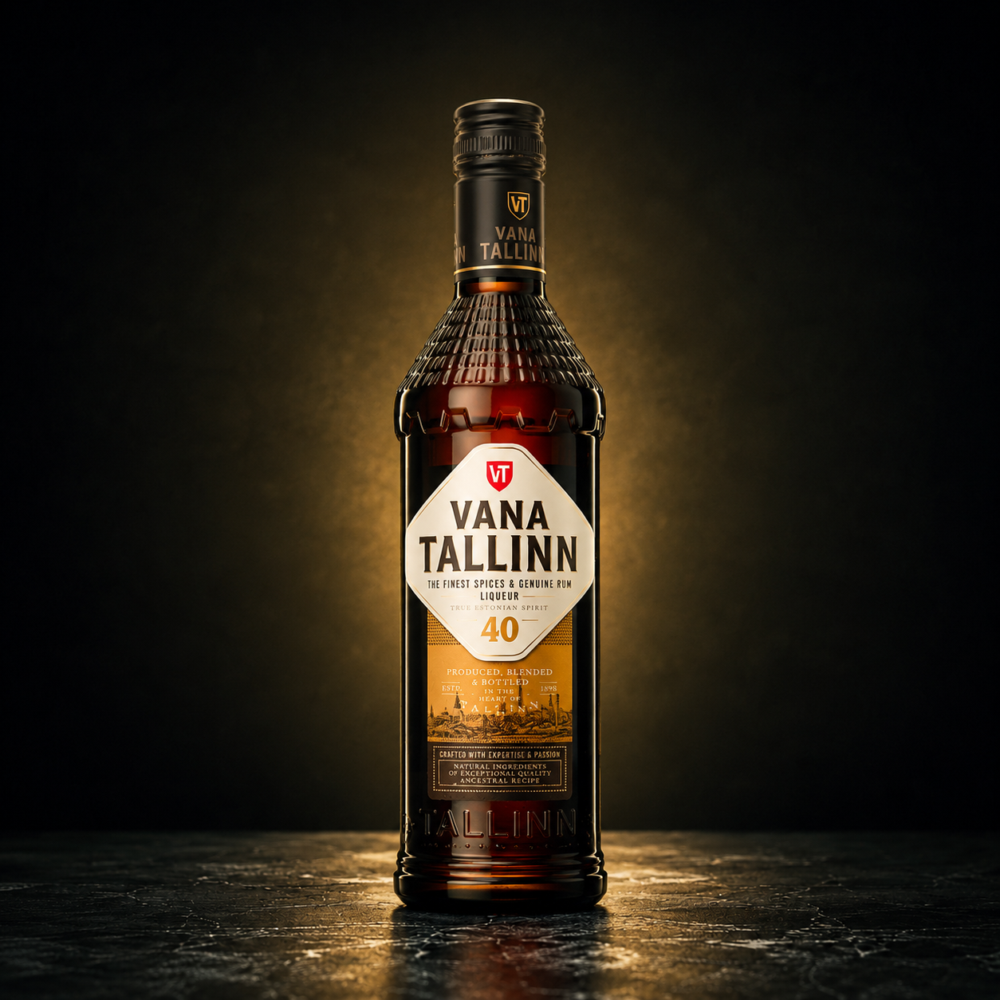
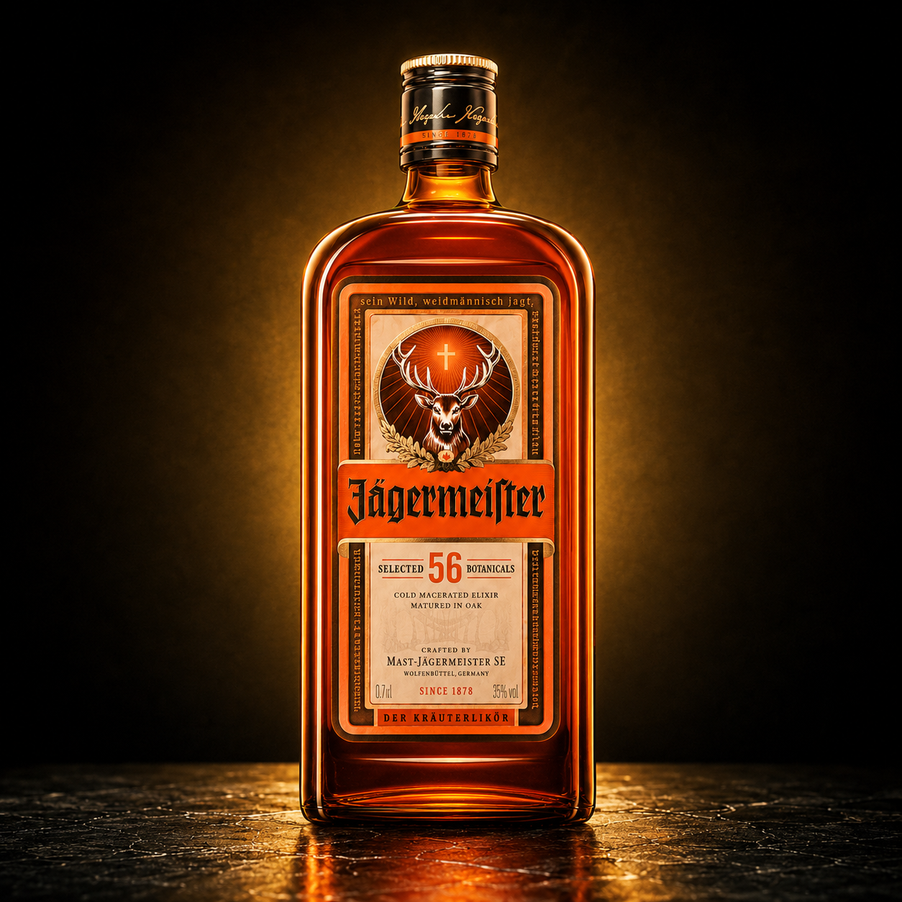
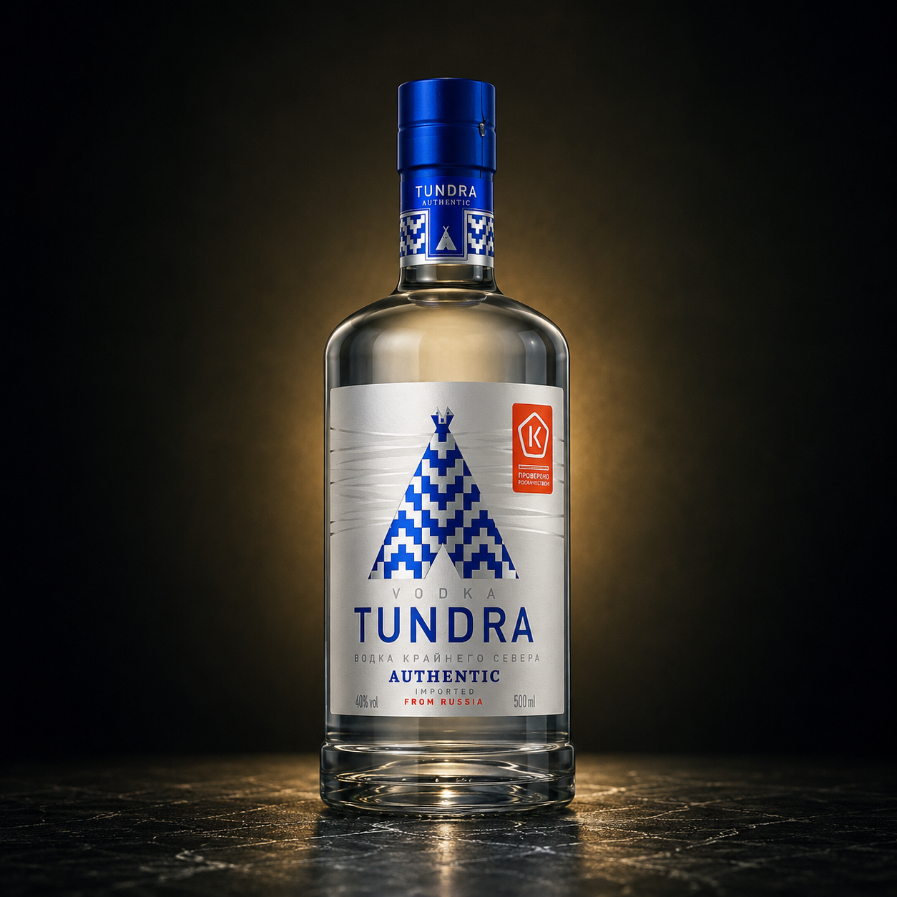
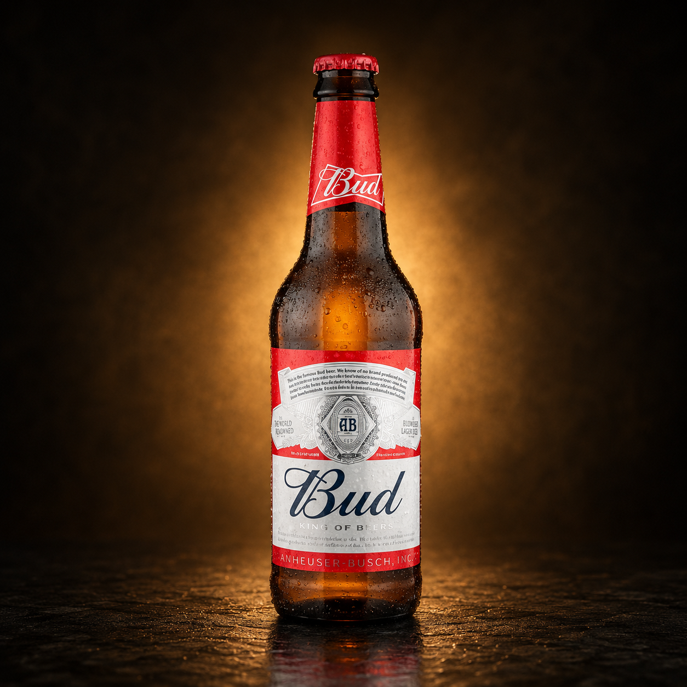
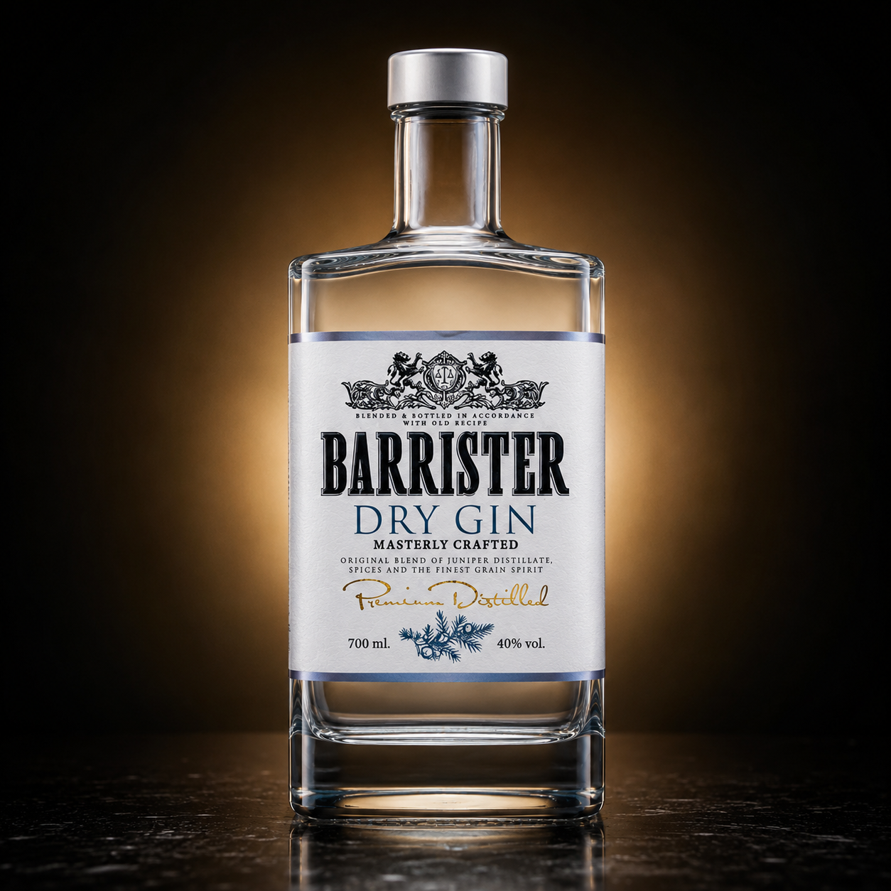
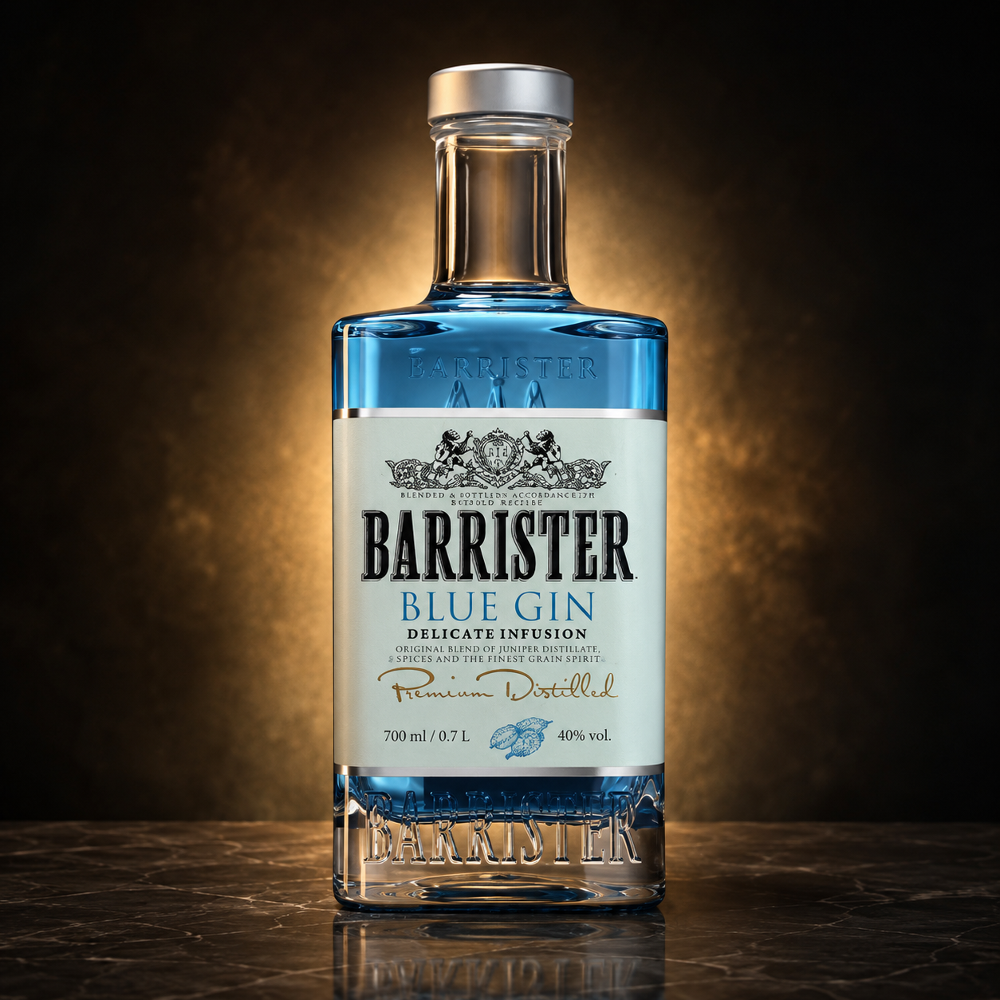
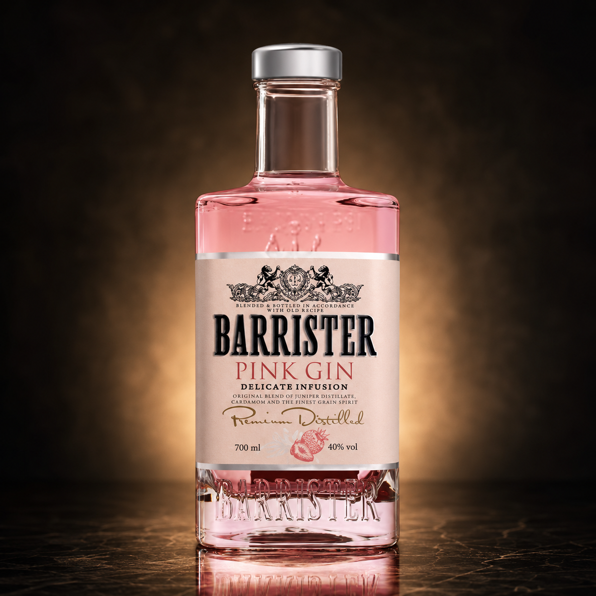
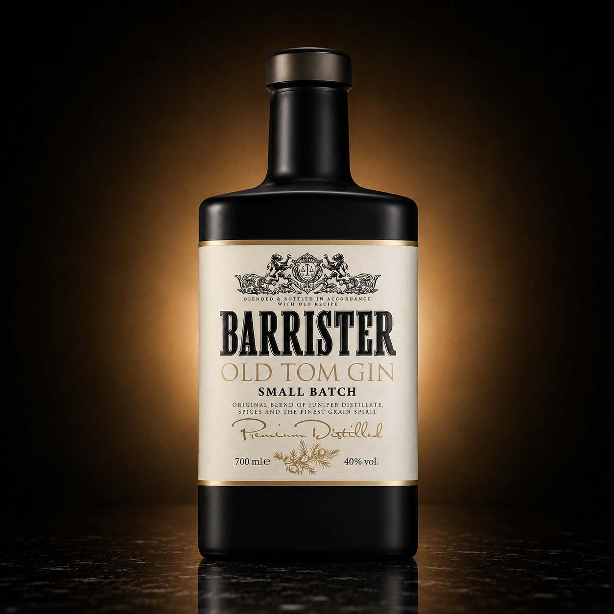
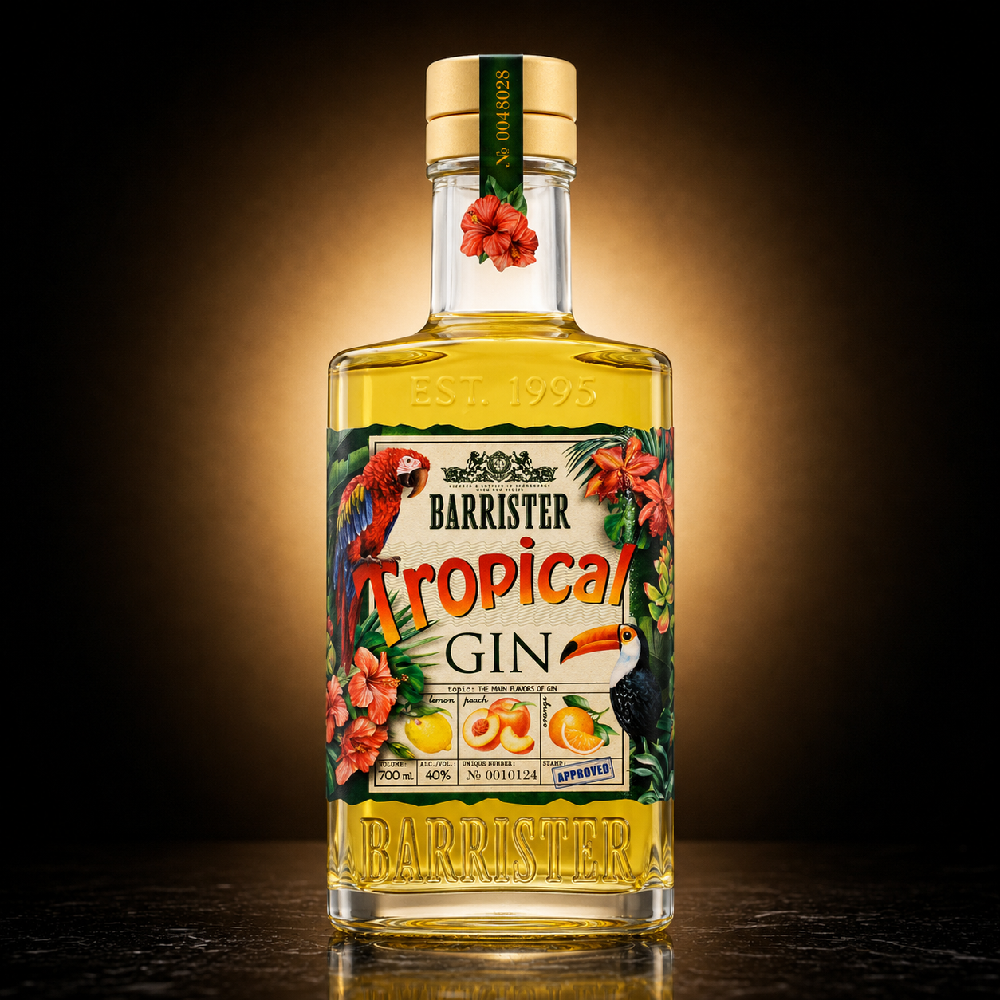
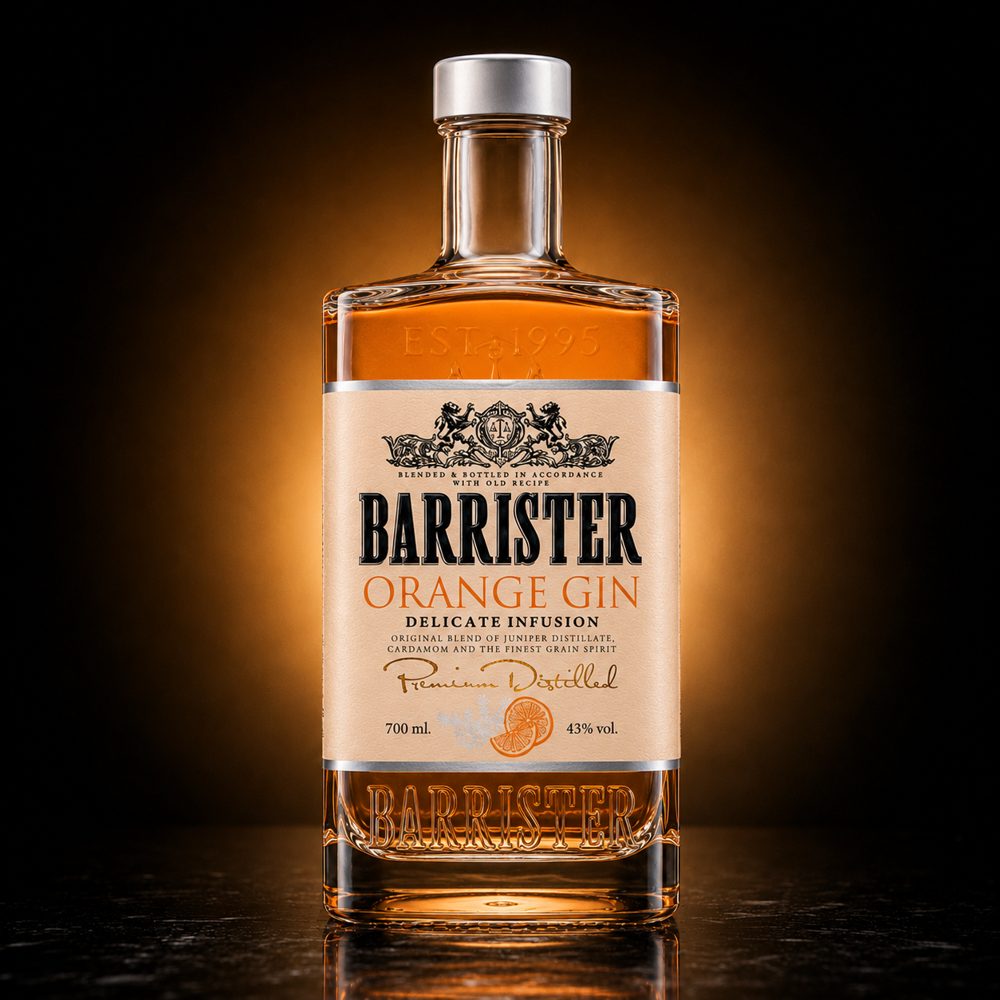

# DRINKS

Каталог изображений и заготовок для напитков Бухлографа.

| # | Изображение | Название и вкус | Крепость | Объем | Примерная цена |
|---|---|---|---:|---:|---:|
| 1 |  | **Vana Tallinn Classic** — ромово-цитрусовый травяной ликер с ванильной сладостью | 40% | 500 мл | 1100 ₽ |
| 2 |  | **Jägermeister Orange** — травяной ликер с выраженным апельсиновым вкусом | 33% | 700 мл | 1800 ₽ |
| 3 |  | **Tundra Authentic** — классическая мягкая водка без вкусовых добавок | 40% | 500 мл | 450 ₽ |
| 4 |  | **Bud** — светлый лагер с мягким солодовым вкусом | 5% | 450 мл | 90 ₽ |
| 5 |  | **Barrister Dry Gin** — классический сухой джин с можжевеловым профилем | 40% | 700 мл | 850 ₽ |
| 6 |  | **Barrister Blue Gin** — голубой джин с цитрусово-пряным характером | 40% | 700 мл | 900 ₽ |
| 7 |  | **Barrister Pink Gin** — розовый джин с ягодно-клубничным оттенком | 40% | 700 мл | 900 ₽ |
| 8 |  | **Barrister Old Tom Gin** — сладковатый джин в стиле Old Tom | 40% | 700 мл | 950 ₽ |
| 9 |  | **Barrister Tropical Gin** — джин с тропическим фруктовым вкусом | 40% | 700 мл | 950 ₽ |
| 10 |  | **Barrister Orange Gin** — джин с апельсиновым вкусом | 40% | 700 мл | 950 ₽ |
| 11 |  | **Jägermeister Classic** — немецкий травяной ликер с пряно-горьким вкусом | 35% | 700 мл | 1900 ₽ |

## Firebase

Файл `catalog.json` содержит готовые заготовки документов для коллекции Firestore `products`.

Поля подобраны под текущую модель приложения:

- `name`
- `brand`
- `description`
- `category`
- `volumeMl`
- `strengthPercent`
- `imageUrl`
- `recommendedPriceRub`
- `tags`
- `source`
- `isVerified`
- `isActive`

Цены примерные и нужны только как демонстрационные значения для учебного проекта.
